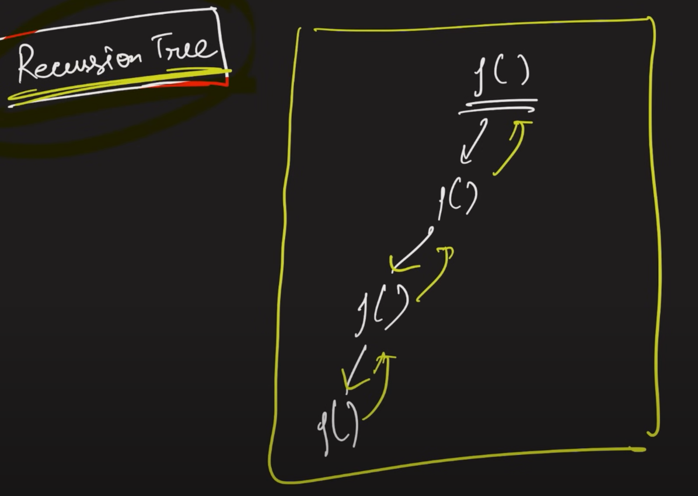
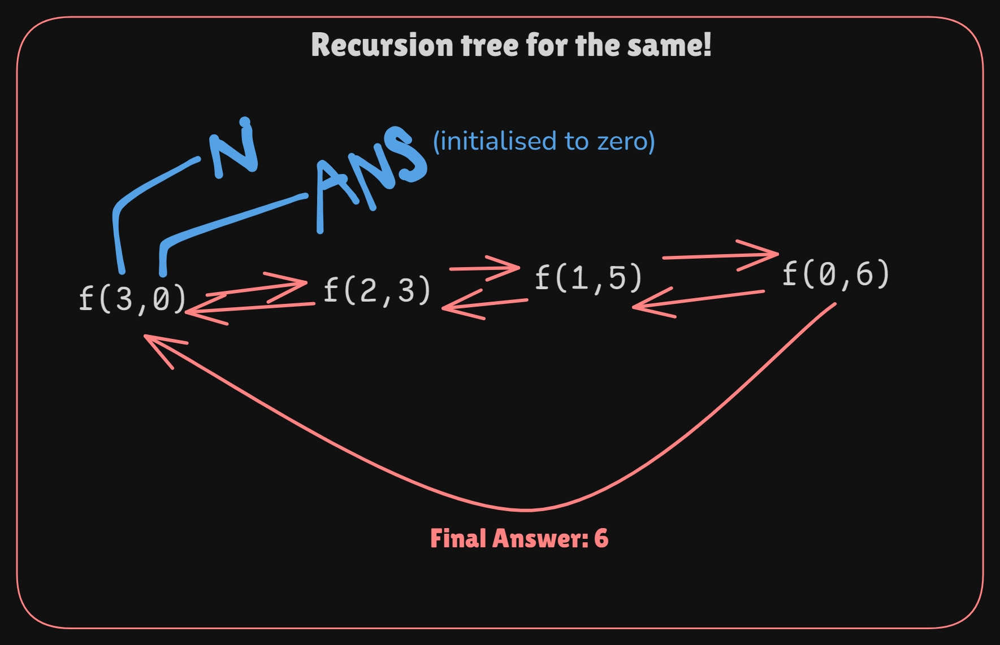

### Base Condition
- **Base Condition** (or the **Stopping condition**), to stop the Infinite recursion.
---
### Recursion Tree

- Time complexity & Space complexity: BigO(N)
---
### Backtracking
- A backtracking algorithm is a problem-solving algorithm that uses a brute force approach for finding the desired output.
- The Brute force approach tries out all the possible solutions and chooses the desired/best solutions.
---
### Parameterized & functional Recursion
-   ```cpp
    int sumOfFirstN(int N, int ans = 0)
    {
        if (N == 0)
        {
            return ans;
        }
        sumOfFirstN(N - 1, ans + N);
    }
    ```
- 
---
### String in C++
- indexes of the string can be accessed.
- there are a lot of string fucntions.
- ```cpp
    string s1 = "HELLO";
    cout << s1[0] << " " << s1[s1.length() - 1] << endl;
    ```
---
### Code snippets
- ```cpp
    void swappWithRec(int i, int arr[], int n)
    {
        if (i >= n / 2)
            return;
        swap(arr[i], arr[n - i - 1]);
        swappWithRec(i + 1, arr, n);
    }

    bool checkStringPalind(int i, string s, int n)
    {
        if (i >= n / 2)
            return true;
        if (s[i] != s[n - i - 1])
            return false;
        return checkStringPalind(i + 1, s, n);
    }
    ```
